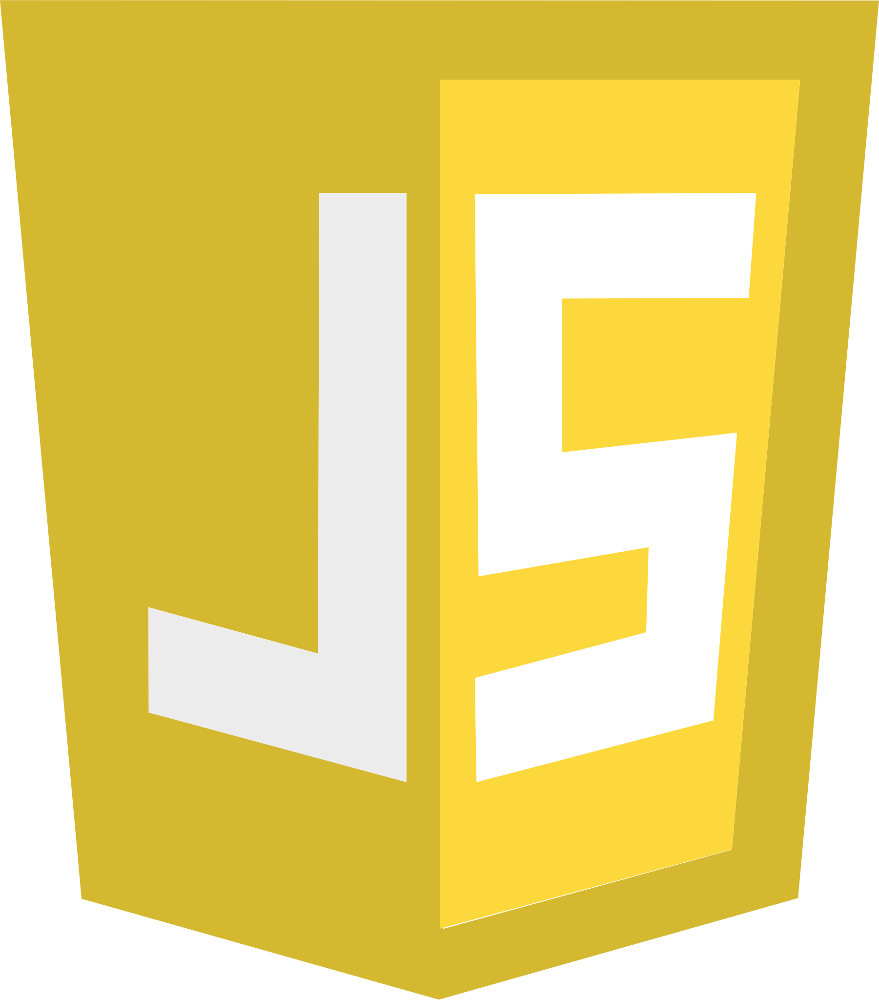

# Astronomy Engine

### Supported Programming Languages

<table style="border-width: 0px;" cellspacing="0" cellpadding="10">
    <tr>
        <td style="text-align: center;">
            
C

            

        </td>
        <td style="text-align: center;">
            
C#

            

        </td>
        <td style="text-align: center;">
            
Browser

            

        </td>
        <td style="text-align: center;">
            
Node.js

            

        </td>
        <td style="text-align: center;">
            
Python

            

        </td>
    </tr>
    <tr>
        <td style="text-align: center;"><a href="demo/c/">Examples</a></td>
        <td style="text-align: center;"><a href="demo/csharp/">Examples</a></td>
        <td style="text-align: center;"><a href="demo/browser/">Examples</a></td>
        <td style="text-align: center;"><a href="demo/nodejs/">Examples</a></td>
        <td style="text-align: center;"><a href="demo/python/">Examples</a></td>
    </tr>
    <tr>
        <td style="text-align: center;"><a href="source/c/">Documentation</a></td>
        <td style="text-align: center;"><a href="source/csharp/">Documentation</a></td>
        <td style="text-align: center;"><a href="source/js/">Documentation</a></td>
        <td style="text-align: center;"><a href="source/js/">Documentation</a></td>
        <td style="text-align: center;"><a href="source/python/">Documentation</a></td>
    </tr>
</table>

### Overview

Astronomy Engine is a suite of open source libraries for calculating positions of
the Sun, Moon, and planets, and for predicting interesting events like oppositions,
conjunctions, rise and set times, lunar phases, eclipses, transits, and more.

It supports several popular programming langauges with a consistent API.
Function and type names are uniform across all the supported languages.

Astronomy Engine is designed to be small, fast, and accurate to within &plusmn;1 arcminute.
It is based on the authoritative and well-tested models
[VSOP87](https://en.wikipedia.org/wiki/VSOP_(planets))
and
[NOVAS C 3.1](https://aa.usno.navy.mil/software/novas/novas_c/novasc_info.php).

These libraries are rigorously unit-tested against NOVAS,
[JPL Horizons](https://ssd.jpl.nasa.gov/horizons.cgi),
and other reliable sources of ephemeris data.
Calculations are also verified to be identical among all the supported programming languages.

### Features

- Provides calculations for the Sun, Moon, Mercury, Venus, Earth, Mars, Jupiter, Saturn, Uranus, Neptune, and Pluto.

- Calculates all supported objects for any calendar date and time for millennia
  before or after the present.

- Provides heliocentric and geocentric Cartesian vectors of all the above bodies.

- Determines apparent horizon-based positions for an observer anywhere on the Earth,
  given that observer's latitude, longitude, and elevation in meters.
  Optionally corrects for atmospheric refraction.

- Calculates rise, set, and culmination times of Sun, Moon, and planets.

- Finds civil, nautical, and astronomical twilight times (dusk and dawn).

- Finds date and time of Moon phases: new, first quarter, full, third quarter
  (or anywhere in between as expressed in degrees of ecliptic longitude).

- Predicts lunar and solar eclipses.

- Predicts transits of Mercury and Venus.

- Predicts lunar apogee and perigee dates, times, and distances.

- Predicts date and time of equinoxes and solstices for a given calendar year.

- Determines apparent visual magnitudes of all the supported celestial bodies.

- Predicts dates of planetary conjunctions, oppositions, and apsides.

- Predicts dates of Venus' peak visual magnitude.

- Predicts dates of maximum elongation for Mercury and Venus.

- Calculates the positions of Jupiter's four largest moons: Io, Europa, Ganymede, and Callisto.

- Converts angular and vector coordinates among the following orientations:
  - Equatorial J2000
  - Equatorial equator-of-date
  - Ecliptic J2000
  - Topocentric Horizontal
  - Galactic (IAU 1958)

- Determines which constellation contains a given point in the sky.

### Why I Created This Thing

I have been an amateur astronomer since childhood. I still remember the amazement
I felt when I saw Saturn through a backyard telescope for the first time.
As a software developer, I naturally became interested in combining my love of
astronomy with my computer programming skills.

In 2008, I started to learn about formulas for calculating positions
of the Moon and planets. I discovered many wonderful resources, including

- Paul Schlyter's lucid and educational page
[How to compute planetary positions](http://www.stjarnhimlen.se/comp/ppcomp.html).
- [Practical Astronomy with your Calculator](https://www.amazon.com/Practical-Astronomy-Calculator-Peter-Duffett-Smith/dp/0521356997), third edition, by Peter Duffett-Smith, Cambridge University Press. ISBN&nbsp;0&nbsp;521&nbsp;35629&nbsp;6.
- [Astronomy on the Personal Computer](https://www.amazon.com/Astronomy-Personal-Computer-Oliver-Montenbruck/dp/3540672214/) by Oliver Montenbruck and Thomas Pfleger. ISBN-13:&nbsp;978-3540672210.

I implemented algorithms based on these resources. Over time, however, I noticed that they were not quite
as accurate as I would like. Their calculated positions differed from those reported by online tools
like [JPL Horizons](https://ssd.jpl.nasa.gov/horizons.cgi) and [Heavens Above](https://www.heavens-above.com/)
by large fractions of a degree in many cases.

In 2019 I renewed my interest in astronomy calculations, with the goal of creating something more accurate
that could be written in JavaScript to run inside a browser. I studied how professional
astronomers and space agencies did their calculations. First I looked the United States Naval Observatory's
[NOVAS C 3.1](https://github.com/indigo-astronomy/novas) library. I quickly realized it could not be
ported to the browser environment, because it required very large (hundreds of megabytes)
precomputed ephemeris files.

This led in turn to studying the French *Bureau des Longitudes* model known as
[VSOP87](https://en.wikipedia.org/wiki/VSOP_(planets)). It requires more computation
but the data is much smaller, consisting of trigonometric power series coefficients.
However, it was still too large to fit in a practical web page.

Furthermore, these models were extremely complicated, and far more accurate than what I needed.
NOVAS, for example, performs relativistic calculations to correct for the bending
of light through the gravitational fields of planets, and time dilation due to different
non-intertial frames of reference! My humble needs did not require this herculean level
of complexity. So I decided to create Astronomy Engine with the following engineering goals:

- Support JavaScript, C, C#, and Python with the same algorithms, and verify them to produce identical results.
- No external dependencies! The code must not require anything outside the standard library for each language.
- Minified JavaScript code less than 100K. (The current size is <!--MINIFIED_SIZE-->96407 bytes.)
- Accuracy always within 1 arcminute of results from NOVAS.
- It would be well documented, relatively easy to use, and support a wide variety of common use cases.

The solution I settled on was to truncate the VSOP87 series to make it as small
as possible without exceeding the 1 arcminute error threshold.
I created a code generator that converts the truncated tables into C, C#, JavaScript,
and Python source code. Then I built unit tests that compare the calculations
against the NOVAS C 3.1 code operating on the DE405 ephemeris and other authoritative
sources, including the JPL Horizons tool. Basing on VSOP87 and verifying
against independent trusted sources provides extra confidence that everything is correct.

Pluto was a special case, because VSOP87 does not include a model for it. I ended up writing
a custom gravitation simulator for the major outer planets to model Pluto's orbit.
The results are verified against NOVAS and the model
[TOP2013](https://www.aanda.org/articles/aa/abs/2013/09/aa21843-13/aa21843-13.html).

As far as I know, Astronomy Engine is the only open source solution in existence that
combines very compact code for four major programming languages with such rigorous
validation and testing at a reasonable accuracy threshold.
The 1-arcminute accuracy is not good enough for spacecraft navigation,
but it is good enough for most amateur uses, and allows the code to be much
simpler, faster, and smaller.

I am committed to maintaining this project for the long term, and I am happy to
answer questions about how to solve various astronomy calculation problems
using Astronomy Engine. Feel free to reach out on the
[discussions page](https://github.com/cosinekitty/astronomy/discussions) or
[submit a new issue](https://github.com/cosinekitty/astronomy/issues).

### Acknowledgements

