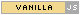

# JavaScript examples for the browser
You can use the JavaScript version of Astronomy Engine
to perform client-side astronomy calculations in a web browser.
Calculations are offloaded to the visitor's computer.

Just grab a copy of 
[`astronomy.browser.js`](../../source/js/astronomy.browser.js)
or the minimized [`astronomy.browser.min.js`](../../source/js/astronomy.browser.min.js)
and save it on your server. Inside your HTML code, pull in the script as usual:

```html
<script src="astronomy.browser.js"></script>
```

 There are no external dependencies! 
Astronomy Engine is completely self-contained, and it always will be.

(By the way, you can use the file `astronomy.js` for 
[astronomy calculations in Node.js programs](../nodejs/).)

All the functionality is wrapped inside an object called `Astronomy`.

Here are some example web pages using Astronomy Engine in a web browser.

---

### [Moon Phase Calculator](moonphase.html)
Determines the Moon's current phase and
predicts when the next few quarter phases will occur.

### [Planet Positions](positions.html)
Calculates equatorial and horizontal coordinates of the Sun, Moon, and planets.

### [Rise/Set](riseset.html)
Shows how to calculate sunrise, sunset, moonrise, and moonset times.

### [More JavaScript examples](../nodejs/)
The Node.js examples page has additional JavaScript examples that can be adapted to the browser environment,
using the same Astronomy Engine source code.

---

# [API Reference](../../source/js/)
Complete documentation for all the functions and types available
in the JavaScript version of Astronomy Engine.
